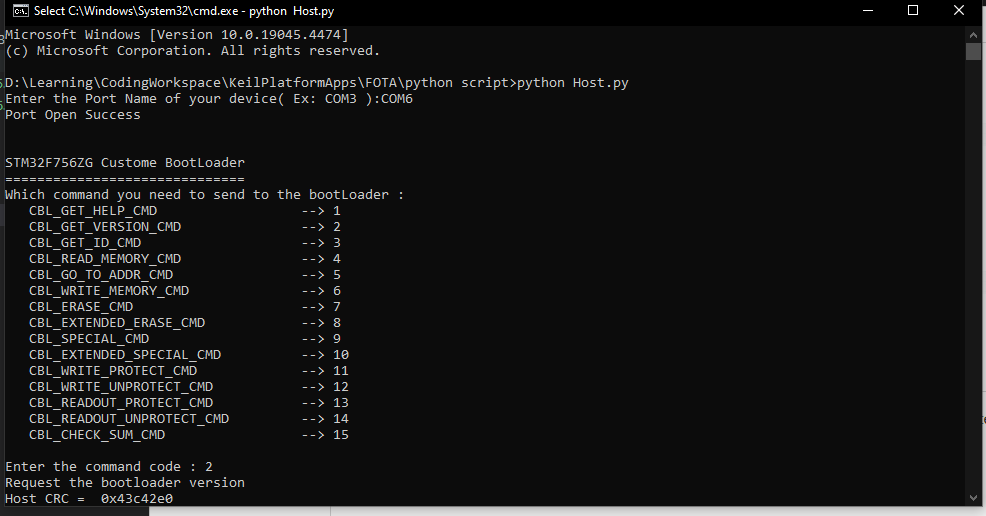
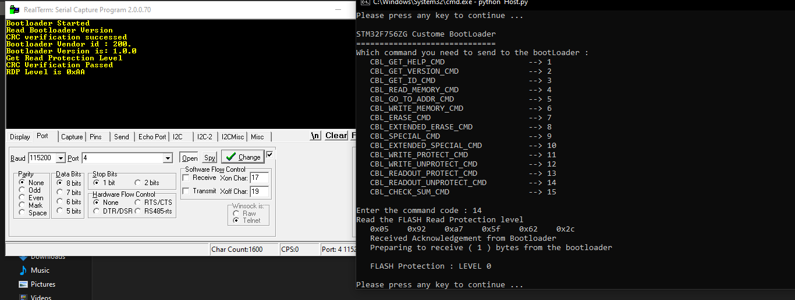

<div align="center">

[]()[](https://github.com/kylelobo/The-Documentation-Compendium/issues)[](https://github.com/kylelobo/The-Documentation-Compendium/pulls)[](LICENSE.md)

</div>

# STM32F756ZG Custom Bootloader

## Table of Contents

* [Introduction](#Introduction)
* [Getting Started](#getting_started)
* [Contributing](../CONTRIBUTING.md)
* [License](../CONTRIBUTING.md)

## Introduction

Custom Bootloader Impelmentation For STM32F756ZG Microcontroller using Universal synchronous Asynchronous receiver transmitter (USART) module.

## Getting Started

### Prerequisites

* Keil.
* STM32f756ZG develpoment board.
* Communication interface (USART) for connecting the bootloader to the host device.

These instructions will get you a copy of the project up and running on your local machine for development.

```
git clone https://github.com/mhmoudramadan/STM32F756ZG_Bootloader.git
```

These instructions will get you how to install Python package for Host script.

```
pip install package_name
```

### Installing

A step by step series of examples that tell you how to get a development env running.

* open keil IDE
* Import *uvprojx project

```
Project menu -> open project -> select uvprojx project file
```

* rebuild project
* Connect the development board to your host device
* Power on the development board and initiate the bootloader.
* Flash code into microcontroller
* Follow the instructions to perform firmware updates
* run python script

```
python Host.py
```



* lunch Host side serial capture program

  

## Contributing

Contributions to the bootloader project are welcome! Feel free to submit bug reports, feature requests, or pull requests to improve the bootloader's functionality.

## License

This project is licensed under the MIT License - see the [LICENSE](LICENSE) file for details.
